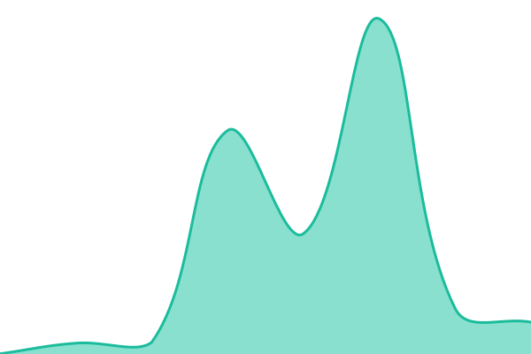

# [📈 Live Status](https://status.weatherfast.aadish.dev): <!--live status--> **🟩 All systems operational**

This repository contains the open-source uptime monitor and status page for [Upptime](https://upptime.js.org), powered by [Upptime](https://github.com/upptime/upptime).

With [Upptime](https://upptime.js.org), you can get your own unlimited and free uptime monitor and status page, powered entirely by a GitHub repository. We use [Issues](https://github.com/upptime/upptime/issues) as incident reports, [Actions](https://github.com/ASDev-Official/weatherfast-status-monitor/actions) as uptime monitors, and [Pages](https://status.weatherfast.aadish.dev) for the status page.

<!--start: status pages-->
<!-- This summary is generated by Upptime (https://github.com/upptime/upptime) -->
<!-- Do not edit this manually, your changes will be overwritten -->
<!-- prettier-ignore -->
| URL | Status | History | Response Time | Uptime |
| --- | ------ | ------- | ------------- | ------ |
|  [Web App](https://app.weatherfast.aadish.dev) | 🟩 Up | [web-app.yml](https://github.com/ASDev-Official/weatherfast-status-monitor/commits/HEAD/history/web-app.yml) | 

 242ms
     
 | 

<a href="https://weatherfast-status.aadish.dev/history/web-app">100.00%</a>
    

|  [API - Notifications](https://api.weatherfast.aadish.dev) | 🟩 Up | [api-notifications.yml](https://github.com/ASDev-Official/weatherfast-status-monitor/commits/HEAD/history/api-notifications.yml) | 

 217ms
     
 | 

<a href="https://weatherfast-status.aadish.dev/history/api-notifications">100.00%</a>
    

|  [API - Global - Geocoding API](https://geocoding-api.open-meteo.com/v1/search?name=Berlin&count=10&language=en&format=json) | 🟩 Up | [api-global-geocoding-api.yml](https://github.com/ASDev-Official/weatherfast-status-monitor/commits/HEAD/history/api-global-geocoding-api.yml) | 

 566ms
     
 | 

<a href="https://weatherfast-status.aadish.dev/history/api-global-geocoding-api">100.00%</a>
    

|  [API - Global - Weather](https://api.open-meteo.com/v1/forecast) | 🟩 Up | [api-global-weather.yml](https://github.com/ASDev-Official/weatherfast-status-monitor/commits/HEAD/history/api-global-weather.yml) | 

 523ms
     
 | 

<a href="https://weatherfast-status.aadish.dev/history/api-global-weather">100.00%</a>
    

|  [API - Global - Air Quality](https://air-quality-api.open-meteo.com/v1/air-quality) | 🟩 Up | [api-global-air-quality.yml](https://github.com/ASDev-Official/weatherfast-status-monitor/commits/HEAD/history/api-global-air-quality.yml) | 

 530ms
     
 | 

<a href="https://weatherfast-status.aadish.dev/history/api-global-air-quality">100.00%</a>
    

|  [API - SG - Two Hour Forecast](https://api.weatherfast.aadish.dev/api/sg/two-hour-forecast) | 🟩 Up | [api-sg-two-hour-forecast.yml](https://github.com/ASDev-Official/weatherfast-status-monitor/commits/HEAD/history/api-sg-two-hour-forecast.yml) | 

 1096ms
     
 | 

<a href="https://weatherfast-status.aadish.dev/history/api-sg-two-hour-forecast">100.00%</a>
    

|  [API - SG - Twenty Four Hour Forecast](https://api.weatherfast.aadish.dev/api/sg/twenty-four-hr-forecast) | 🟩 Up | [api-sg-twenty-four-hour-forecast.yml](https://github.com/ASDev-Official/weatherfast-status-monitor/commits/HEAD/history/api-sg-twenty-four-hour-forecast.yml) | 

 792ms
     
 | 

<a href="https://weatherfast-status.aadish.dev/history/api-sg-twenty-four-hour-forecast">100.00%</a>
    

|  [API - SG - Four Day Forecast](https://api.weatherfast.aadish.dev/api/sg/four-day-forecast) | 🟩 Up | [api-sg-four-day-forecast.yml](https://github.com/ASDev-Official/weatherfast-status-monitor/commits/HEAD/history/api-sg-four-day-forecast.yml) | 

 964ms
     
 | 

<a href="https://weatherfast-status.aadish.dev/history/api-sg-four-day-forecast">100.00%</a>
    

|  [API - SG - Air Temperature](https://api.weatherfast.aadish.dev/api/sg/air-temperature) | 🟩 Up | [api-sg-air-temperature.yml](https://github.com/ASDev-Official/weatherfast-status-monitor/commits/HEAD/history/api-sg-air-temperature.yml) | 

 1522ms
     
 | 

<a href="https://weatherfast-status.aadish.dev/history/api-sg-air-temperature">100.00%</a>
    

|  [API - SG - Rainfall](https://api.weatherfast.aadish.dev/api/sg/rainfall) | 🟩 Up | [api-sg-rainfall.yml](https://github.com/ASDev-Official/weatherfast-status-monitor/commits/HEAD/history/api-sg-rainfall.yml) | 

 1824ms
     
 | 

<a href="https://weatherfast-status.aadish.dev/history/api-sg-rainfall">100.00%</a>
    

|  [API - SG - Relative Humidity](https://api.weatherfast.aadish.dev/api/sg/relative-humidity) | 🟩 Up | [api-sg-relative-humidity.yml](https://github.com/ASDev-Official/weatherfast-status-monitor/commits/HEAD/history/api-sg-relative-humidity.yml) | 

 1627ms
     
 | 

<a href="https://weatherfast-status.aadish.dev/history/api-sg-relative-humidity">100.00%</a>
    

|  [API - SG - Wind Speed](https://api.weatherfast.aadish.dev/api/sg/wind-speed) | 🟩 Up | [api-sg-wind-speed.yml](https://github.com/ASDev-Official/weatherfast-status-monitor/commits/HEAD/history/api-sg-wind-speed.yml) | 

 1372ms
     
 | 

<a href="https://weatherfast-status.aadish.dev/history/api-sg-wind-speed">100.00%</a>
    

|  [API - SG - PSI](https://api.weatherfast.aadish.dev/api/sg/psi) | 🟩 Up | [api-sg-psi.yml](https://github.com/ASDev-Official/weatherfast-status-monitor/commits/HEAD/history/api-sg-psi.yml) | 

 1006ms
     
 | 

<a href="https://weatherfast-status.aadish.dev/history/api-sg-psi">100.00%</a>
    

|  [API - SG - Flood Alerts](https://api.weatherfast.aadish.dev/api/sg/flood-alerts) | 🟩 Up | [api-sg-flood-alerts.yml](https://github.com/ASDev-Official/weatherfast-status-monitor/commits/HEAD/history/api-sg-flood-alerts.yml) | 

 1402ms
     
 | 

<a href="https://weatherfast-status.aadish.dev/history/api-sg-flood-alerts">100.00%</a>
    

<!--end: status pages-->

[**Visit our status website →**](https://status.weatherfast.aadish.dev)

## 📄 License

- Powered by: [Upptime](https://github.com/upptime/upptime)
- Code: [MIT](./LICENSE) © [Anand Chowdhary](https://anandchowdhary.com)
- Data in the `./history` directory: [Open Database License](https://opendatacommons.org/licenses/odbl/1-0/)
